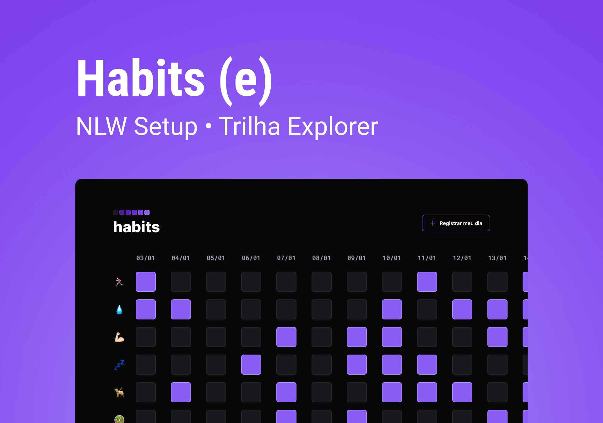

<h1 align = "center">
Projeto Habits
</h1>

Projeto realizado no evento NLW Setup, promovido pela Rocketseat para ensino de tecnologias web.

Esse projeto foi desenvolvido com as seguintes tecnologias:

- HTML e CSS
- JavaScript
- Git e Github
- Figma

## 💻 Projeto

O Habit é um app para ajudar a rastrear os hábitos.

Você pode visualizar o layout do projeto através [Desse-Link](<https://www.figma.com/file/bpJJrCkA4N10DnJT4oD6oV/Habits-(e)-(Community)?t=Efby7MjZ4QoaAm9v-0>).

É necessário ter conta no [Figma](https://figma.com) para acessá-lo

## Licença

Esse projeto está sob a licença MIT.

Feito com 💜 by Rocketseat
[Participe-da-Comunidade!](https://discord.gg;rocketseat)
